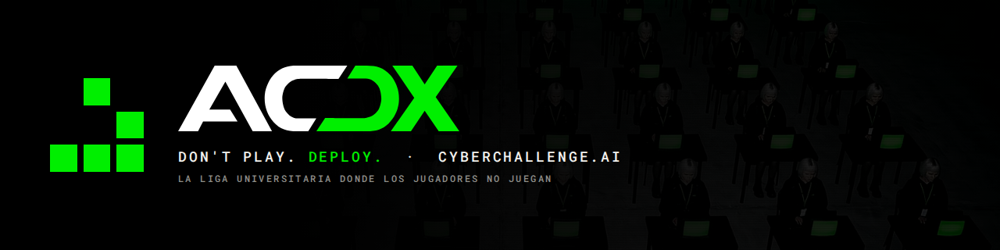

<p align="center"></p>

# cyberchallenge.ai

Web de **ACDX**, la liga universitaria donde los jugadores no juegan: los equipos diseñan, ajustan y despliegan agentes de IA, y son los agentes los que compiten en la arena.

**Don't play. Deploy.** · Temporada 26/27

## Stack

HTML, CSS y JavaScript sin dependencias ni build. Se sirve tal cual con GitHub Pages.

```
index.html        la página
css/              estilos (unis.css lleva los logos de las universidades como data URI)
js/site.js        HUD, split-flaps, revelado de texto, Juego de la Vida
js/spin.js        SPIN-UP (1 → ∞), arsenal de modelos, sonido a 128 BPM
js/flow.js        visor de flujo del agente
media/            vídeo de portada, película y canción
img/              fotogramas, logos, fotos
```

## Local

Abre `index.html` en el navegador, o sirve la carpeta:

```bash
python3 -m http.server 8000
```
